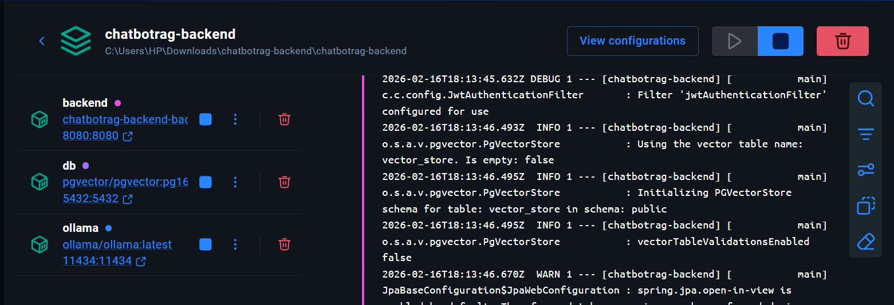
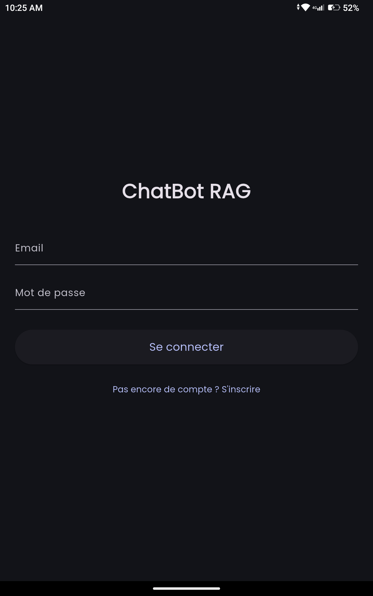
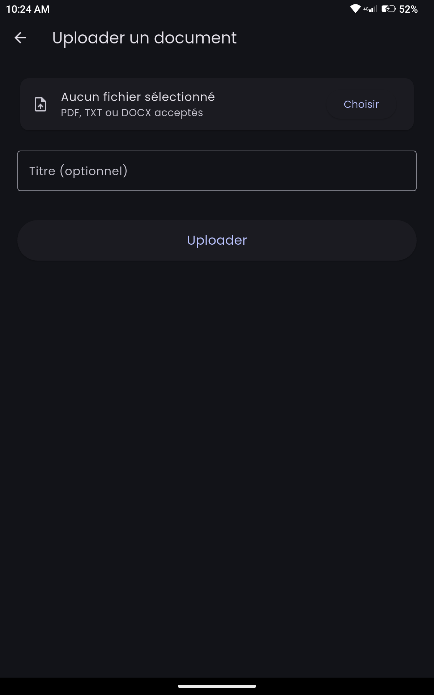
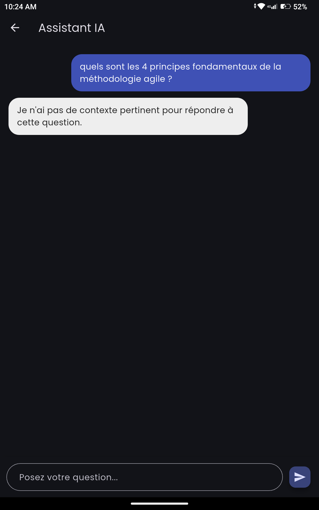
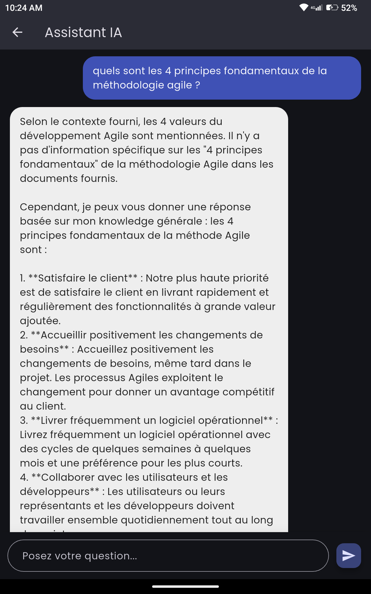
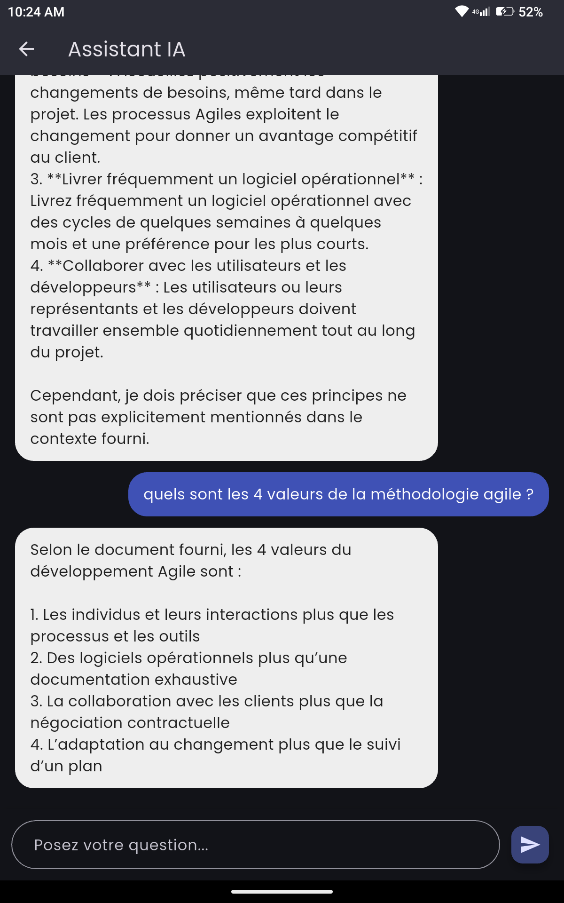
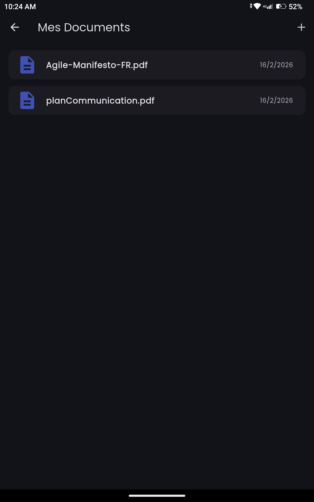

```markdown
# ChatBotRAG

**Assistant IA RAG local** — Posez des questions sur vos documents personnels.

Une application mobile intelligente permettant d’uploader des documents (PDF, TXT, DOCX) et d’interagir avec eux via un chatbot basé sur RAG (Retrieval-Augmented Generation), le tout **100% local** grâce à Ollama.

---

## ✨ Fonctionnalités

- **Upload de documents** : PDF, TXT, DOCX
- **Chat intelligent** avec contexte des documents (RAG)
- **Historique des conversations** persisté
- **Authentification** sécurisée (JWT)
- **Interface mobile fluide** (Flutter)
- **Architecture moderne** : Backend Spring Boot + Ollama + PostgreSQL + pgvector
- **100% offline** après téléchargement initial des modèles

---

## 🛠 Stack Technique

### Frontend
- **Flutter** (Dart) — Application native iOS & Android
- **Riverpod** (state management)
- **GoRouter** (navigation)
- **Dio** (API calls)

### Backend
- **Spring Boot 3** (Java 21)
- **Spring AI** + **Ollama** (RAG local)
- **PostgreSQL 16** + **pgvector** (stockage vectoriel)
- **Apache Tika** (extraction texte multi-format)
- **JWT** (authentification)
- **Docker** + **Docker Compose** (3 conteneurs)

### IA Locale
- **Embeddings** : mxbai-embed-large (1024 dimensions)
- **LLM** : Mistral 7B Instruct (ou Llama 3.2 selon préférence)

---

## 🚀 Installation & Lancement

### 1. Cloner le projet
```bash
git clone https://github.com/votreusername/chatbotrag.git
cd chatbotrag
```

### 2. Lancer le backend (Docker)
```bash
cd chatbotrag-backend
docker compose up --build
```

### 3. Lancer le frontend Flutter
```bash
cd chatbotrag
flutter pub get
flutter run
```

> **Note** : Utilisez `10.0.2.2:8080` sur Android Emulator ou l’IP de votre PC sur appareil physique.

---

## 📸 Captures d’écran

*Container Docker*


*Ecran d'authentification*



*Écran d’accueil avec accès rapide*

*Upload de documents (PDF, TXT, DOCX)*


*Interface de chat avec contexte RAG réponse sans contexte*


*Interface de chat avec contexte RAG réponse avec contexte*


*Interface de chat avec contexte RAG réponse avec contexte*


*Historique des conversations*


*Liste des documents*


---

## 📋 API Endpoints Principaux

| Méthode | Endpoint                        | Description                     |
|--------|----------------------------------|---------------------------------|
| POST   | `/api/auth/register`            | Inscription                     |
| POST   | `/api/auth/login`               | Connexion                       |
| POST   | `/api/documents/upload`         | Upload document                 |
| GET    | `/api/documents`                | Liste des documents             |
| DELETE | `/api/documents/{id}`           | Suppression document            |
| POST   | `/api/chat/send`                | Envoyer message                 |
| GET    | `/api/chat/conversations`       | Liste conversations             |
| GET    | `/api/chat/conversation/{id}`   | Détails d’une conversation      |
| DELETE | `/api/chat/conversation/{id}`   | Suppression conversation        |

---

## 📁 Structure du Projet

```
ChatBotRAG/
├── chatbotrag-backend/                  # Spring Boot + Ollama
│   ├── src/main/java/com/chatbotrag/
│   ├── docker-compose.yml
│   └── pom.xml
│
├── chatbotrag/                 # Flutter Mobile
│   ├── lib/
│   │   ├── features/
│   │   ├── shared/
│   │   └── main.dart
│   └── pubspec.yaml
│
├── screenshots/              # Captures d'écran
└── README.md
```

---

## 🎯 Points Forts du Projet

- Architecture **moderne** et scalable
- **100% local** (aucune API externe après setup)
- RAG performant avec contexte utilisateur isolé
- UI/UX soignée et responsive
- Code propre, commenté et maintenable

---

## 🛠 Améliorations futures

- Export PDF des réponses / lettres générées
- Support de plus de formats (images, Excel)
- Mode multi-utilisateur
- Recherche sémantique avancée
- Indicateur de streaming des réponses

---

**Développé avec ❤️ par SAWADOGO S Abdel**

---

